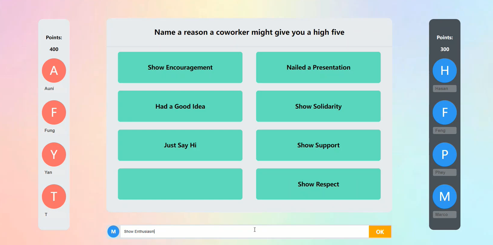

# FEUD

<!-- Improved compatibility of back to top link: See: https://github.com/othneildrew/Best-README-Template/pull/73 -->

<a name="readme-top"></a>

<!-- PROJECT LOGO -->

<br />
<div align="center">
  <a href="https://github.com/othneildrew/Best-README-Template">
    
  </a>

<h3 align="center">Workshop Feud</h3>

<p align="center">
    An awesome Feud game for knowledge quiz!
    <br />
    <a href="https://github.com/yuenci/Feud"><strong>Explore the docs »</strong></a>
  </p>
</div>

<!-- ABOUT THE PROJECT -->

## About The Project




Feud is a popular game show that has been around since the 1960s. It is a game of trivia and guessing, where two teams compete to answer questions about popular culture. The team with the most points at the end of the game wins.

We need to play this game in the course of Workplace Professional Communication Skills, but there is no suitable platform to use, so we created this project for Feud.


<p align="right">(<a href="#readme-top">back to top</a>)</p>

### Built With

* [Jquery.js](https://jquery.com/) - A library is designed to simplify the client-side scripting of HTML
* [Party.js](https://party.js.org/) - A JavaScript library intended to provide customizeable particle effects to browser environments
* [Layer.js](https://layuion.com/layer/) - A popular Web pop-up layer component.

<p align="right">(<a href="#readme-top">back to top</a>)</p>

<!-- GETTING STARTED -->

## Getting Started

### Installation

1. Clone the repo
   ```sh
   git clone https://github.com/yuenci/Feud/
   ```
2. Install packages
   ```sh
   yarn
   ```
3. Run peoject
   ```js
   yarn dev
   ```

<p align="right">(<a href="#readme-top">back to top</a>)</p>

<!-- USAGE EXAMPLES -->

## Usage

1. Fill in the contestant's names


2. Select a team, enter the answer and start the game!


<p align="right">(<a href="#readme-top">back to top</a>)</p>

<!-- ROADMAP -->

## Roadmap

- [ ] Add questions and answers in front end.
- [ ] Automatically determine the number of questions.

See the [open issues](https://github.com/othneildrew/Best-README-Template/issues) for a full list of proposed features (and known issues).

<p align="right">(<a href="#readme-top">back to top</a>)</p>

<!-- CONTRIBUTING -->

## Authors

<a href="https://github.com/yuenci">
  
</a>

<a href="https://github.com/Kaikiat1126">
  
</a>

<!-- LICENSE -->

## License

Distributed under the MIT License. See [LICENSE](./LICENSE) for more information.

<p align="right">(<a href="#readme-top">back to top</a>)</p>
